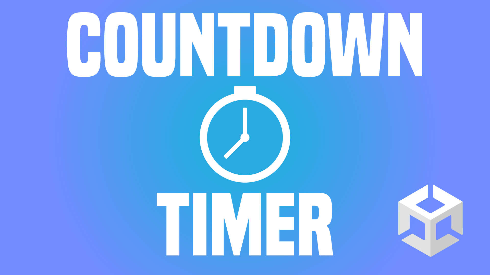

# Countdown in Unity

In diesem Video zeige ich dir, wie du einen Countdown in Unity einbauen kannst!

- [🎬 YT Tutorial](https://youtu.be/-us6OMlwTwo)
- [💬 Joint unserem Discord Server](https://discord.gg/kusy4JQ4)
- [👍 Abonniert um keine Videos zu verpassen](https://www.youtube.com/@prezipgames)

## Viel Spaß beim Entwickeln!
